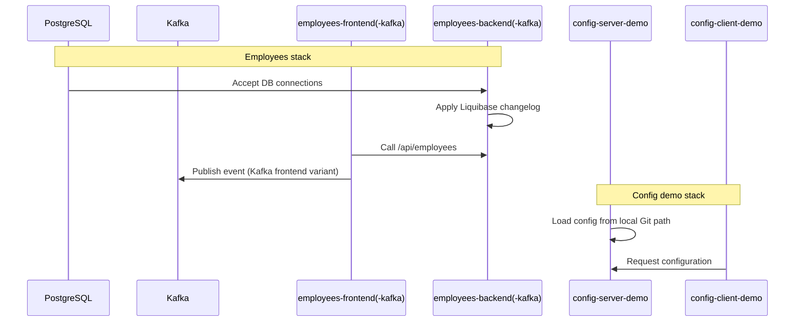

# Spring Cloud Training Workspace

This repository contains Spring Boot/Spring Cloud demos, with both non-Kafka and Kafka-enabled employee app variants.

## What Is In This Repo

- `config-server-demo`: Spring Cloud Config Server (`:8888`)
- `config-client-demo`: Spring Cloud Config Client sample
- `employees-backend`: REST API + PostgreSQL + Liquibase (`:8081`)
- `employees-frontend`: server-side UI for `employees-backend` (`:8080`)
- `employees-backend-kafka`: backend variant (same API/DB profile, `:8081`)
- `employees-frontend-kafka`: frontend variant with Kafka producer (`:8080`)
- `kafka/`: Docker Compose infra for Kafka + Kafdrop

## Architecture

```mermaid
flowchart LR
    subgraph EmployeesBase[Employees stack (base)]
        Browser[Browser] --> FE[employees-frontend\n:8080]
        FE --> BE[employees-backend\n:8081]
        BE --> PG[(PostgreSQL\n:5432)]
    end

    subgraph EmployeesKafka[Employees stack (Kafka variant)]
        BrowserK[Browser] --> FEK[employees-frontend-kafka\n:8080]
        FEK --> BEK[employees-backend-kafka\n:8081]
        BEK --> PG
        FEK -->|publish event| Kafka[Kafka broker\n:9092]
        Kafdrop[Kafdrop UI\n:9000] --> Kafka
    end

    Client[config-client-demo] --> ConfigServer[config-server-demo\n:8888]
    ConfigServer --> ConfigRepo[(Local Git config repo\nfile:///C:/Training/config)]
```

## Important Choice

Run only one employees pair at a time:

- base pair: `employees-backend` + `employees-frontend`
- Kafka pair: `employees-backend-kafka` + `employees-frontend-kafka`

Both pairs use the same ports (`8080` and `8081`), so running both together causes port conflicts.

## Kafka Infra (`kafka/docker-compose.yaml`)

Single-node KRaft cluster (no ZooKeeper).

| Service | Image | Ports |
|---|---|---|
| `kafka` | `apache/kafka:4.2.0` | `9092` (host access) |
| `kafdrop` | `obsidiandynamics/kafdrop:4.2.0` | `9000` (web UI) |

Listener layout:

- `EXTERNAL` (`:9092`) for host-machine clients
- `CLIENT` (`kafka:9093`) for Docker-network clients (for example Kafdrop)
- `CONTROLLER` (`:9094`) for KRaft controller traffic

## Prerequisites

- Java + Maven Wrapper (`mvnw`/`mvnw.cmd` in each module)
- Docker (PostgreSQL + Kafka)

## Quick Start

### 1) Start PostgreSQL

```powershell
docker run -d -e POSTGRES_DB=employees -e POSTGRES_USER=employees -e POSTGRES_PASSWORD=employees -p 5432:5432 --name employees-postgres postgres
```

### 2) Start Kafka + Kafdrop

```powershell
docker compose -f kafka/docker-compose.yaml up -d
```

Kafdrop UI: `http://localhost:9000`

Stop Kafka stack:

```powershell
docker compose -f kafka/docker-compose.yaml down
```

### 3) Start one employees app pair

Base pair:

```powershell
cd employees-backend
.\mvnw.cmd spring-boot:run
```

```powershell
cd employees-frontend
.\mvnw.cmd spring-boot:run
```

Kafka pair:

```powershell
cd employees-backend-kafka
.\mvnw.cmd spring-boot:run
```

```powershell
cd employees-frontend-kafka
.\mvnw.cmd spring-boot:run
```

Open UI: `http://localhost:8080`

### 4) Optional config demo

```powershell
cd config-server-demo
.\mvnw.cmd spring-boot:run
```

```powershell
cd config-client-demo
.\mvnw.cmd spring-boot:run
```

## Startup Order



## Useful Endpoints

- Frontend UI: `http://localhost:8080`
- Backend API list: `GET http://localhost:8081/api/employees`
- Backend API by id: `GET http://localhost:8081/api/employees/{id}`
- Kafdrop: `http://localhost:9000`

Ready-to-run API requests: `employees-backend/employees.http`

## Notes

- Config Server points to `file:///C:/Training/config`; adjust `config-server-demo/src/main/resources/application.properties` if needed.
- `employees-frontend-kafka` defines topic `hello` and publishes an event when creating an employee.
- `UserController` in frontend modules references extra auth-related properties for some scenarios.
