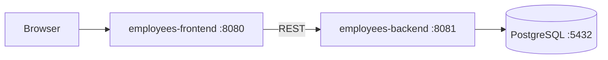
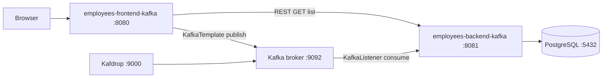
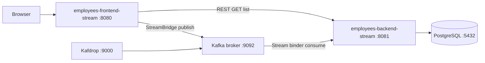
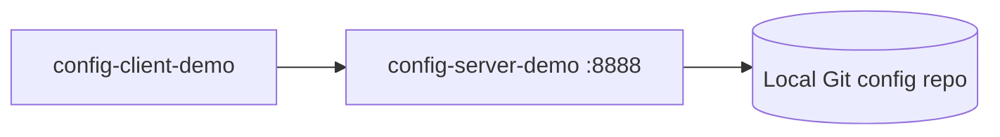
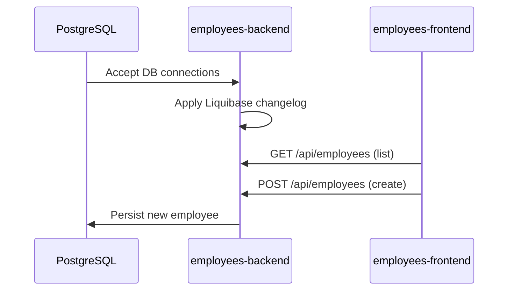
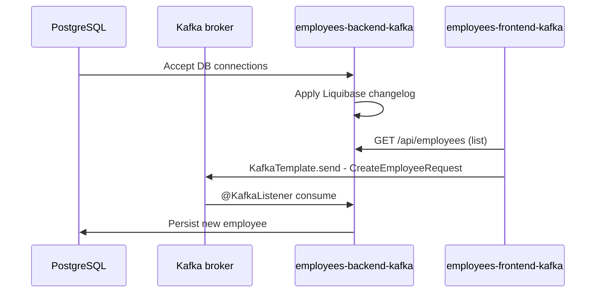
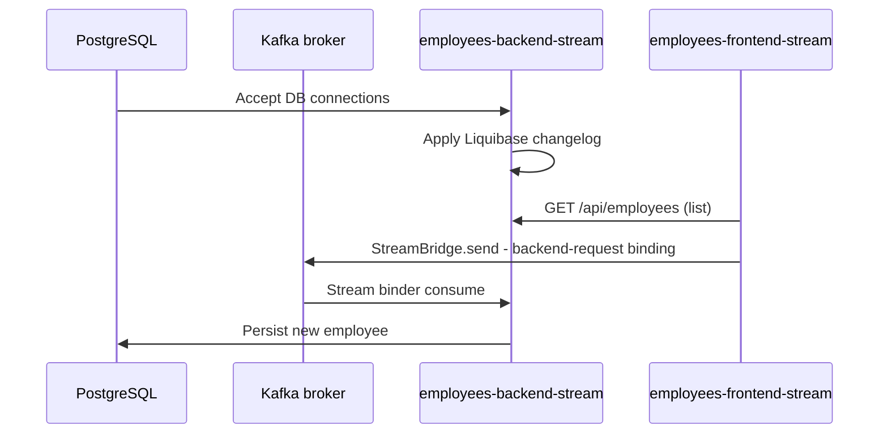

# Spring Cloud Training Workspace

This repository contains Spring Boot/Spring Cloud demos across three employees app variants: plain REST, raw Kafka, and Spring Cloud Stream.

## Tutor Repository

- [Training360/javax-sc-2026-05-06](https://github.com/Training360/javax-sc-2026-05-06)

## What Is In This Repo

### Base pair (plain REST)

- `employees-backend`: REST API + PostgreSQL + Liquibase (`:8081`)
- `employees-frontend`: Thymeleaf UI, REST client (`:8080`)

### Kafka pair (raw Spring Kafka)

- `employees-backend-kafka`: adds `KafkaGateway` with `@KafkaListener` (`:8081`)
- `employees-frontend-kafka`: sends create via raw `KafkaTemplate` (`:8080`)

### Stream pair (Spring Cloud Stream)

- `employees-backend-stream`: Spring Cloud Stream + Kafka binder (`:8081`)
- `employees-frontend-stream`: sends create via `StreamBridge` (`:8080`)

### Infra / other

- `kafka/`: Docker Compose — single-node KRaft Kafka + Kafdrop
- `employees-schema-registry`: Schema Registry for Kafka message schemas (`:8990`)
- `config-server-demo`: Spring Cloud Config Server (`:8888`)
- `config-client-demo`: Spring Cloud Config Client sample
- `java-se`: standalone Java SE Maven project (`training:java-se`)

## Spring Ecosystem Overview

| Project | Role |
| --- | --- |
| **Spring Framework** | Core foundation: DI, IoC, AOP, transactions, MVC/WebFlux |
| **Spring Boot** | Auto-configuration, embedded servers, sensible defaults, production features |
| **Spring Cloud** | Distributed systems toolbox: config, discovery, circuit breakers, gateways, tracing |
| **Spring Data** | Repository abstractions over SQL, JPA, JDBC, NoSQL, Redis, Elasticsearch |
| **Spring Security** | Auth, authorization, OAuth2, JWT, CSRF, method security |
| **Spring Integration** | Enterprise integration patterns: channels, routers, adapters |
| **Spring Batch** | Large-scale batch processing: chunked reads/writes, retries, restarts |
| **Spring AI** | LLM abstractions, embeddings, vector stores, RAG (not covered in this course) |

Spring Boot apps follow the [12-factor app methodology](https://12factor.net/).

## Java SE Language Showcase (`java-se`)

Modern Java 26 features demonstrated in this module:

- **Records** — immutable domain models: `Pont`, `Kor`, `Teglalap`
- **Sealed classes** — explicit permitted hierarchy: `Alakzat permits Kor, Teglalap`
- **Pattern matching `switch`** over a sealed type in `Main#szamitKozeppont`
- **Record patterns** in `switch` cases (`case Kor(Pont kozeppont, _)`)
- **Unnamed variables** — `_` wildcard in record patterns
- **Local variable type inference** — `var`
- **Virtual threads** — lightweight concurrency via `Thread.ofVirtual()` (Project Loom)
- **Data-oriented programming** — prefer immutable value types over deep OOP hierarchies; reduce class proliferation with sealed types + pattern matching

## Architecture

### Base pair



### Kafka pair



### Stream pair



### Config demo



## Important Choice

Run only one employees pair at a time:

- base pair: `employees-backend` + `employees-frontend`
- Kafka pair: `employees-backend-kafka` + `employees-frontend-kafka`
- Stream pair: `employees-backend-stream` + `employees-frontend-stream`

All three pairs use the same ports (`8080` and `8081`), so running more than one together causes port conflicts.

## Kafka Infra (`kafka/docker-compose.yaml`)

Single-node KRaft cluster (no ZooKeeper).

| Service | Image | Ports |
|---|---|---|
| `kafka` | `apache/kafka:4.2.0` | `9092` (host access) |
| `kafdrop` | `obsidiandynamics/kafdrop:4.2.0` | `9000` (web UI) |

Listener layout:

- `EXTERNAL` (`:9092`) for host-machine clients
- `CLIENT` (`kafka:9093`) for Docker-network clients (for example Kafdrop)
- `CONTROLLER` (`:9094`) for KRaft controller traffic

**Optional**: `employees-schema-registry` (port `:8990`) is a separate Spring Boot app for managing Avro/JSON schemas. Start it with `cd employees-schema-registry; .\mvnw.cmd spring-boot:run` if using schema-based serialization in the Stream variant.

## Prerequisites

- JDK 26
- Git
- IntelliJ IDEA Ultimate
- Docker (PostgreSQL + Kafka)
- Maven Wrapper (`mvnw`/`mvnw.cmd`) included in each module — no separate Maven install needed

## Quick Start

### 1) Start PostgreSQL

```powershell
docker run -d -e POSTGRES_DB=employees -e POSTGRES_USER=employees -e POSTGRES_PASSWORD=employees -p 5432:5432 --name employees-postgres postgres
```

### 2) Start Kafka + Kafdrop

```powershell
docker compose -f kafka/docker-compose.yaml up -d
```

Kafdrop UI: `http://localhost:9000`

Stop Kafka stack:

```powershell
docker compose -f kafka/docker-compose.yaml down
```

### 3) Start one employees app pair

Base pair:

```powershell
cd employees-backend
.\mvnw.cmd spring-boot:run
```

```powershell
cd employees-frontend
.\mvnw.cmd spring-boot:run
```

Kafka pair:

```powershell
cd employees-backend-kafka
.\mvnw.cmd spring-boot:run
```

```powershell
cd employees-frontend-kafka
.\mvnw.cmd spring-boot:run
```

Stream pair:

```powershell
cd employees-backend-stream
.\mvnw.cmd spring-boot:run
```

```powershell
cd employees-frontend-stream
.\mvnw.cmd spring-boot:run
```

Open UI: `http://localhost:8080`

### 4) Optional config demo

```powershell
cd config-server-demo
.\mvnw.cmd spring-boot:run
```

```powershell
cd config-client-demo
.\mvnw.cmd spring-boot:run
```

## Startup Order

### Base pair startup



### Kafka pair startup



### Stream pair startup



## Useful Endpoints

- Frontend UI: `http://localhost:8080`
- Backend API list: `GET http://localhost:8081/api/employees`
- Backend API by id: `GET http://localhost:8081/api/employees/{id}`
- Config client demo: `GET http://localhost:8080/api/hello` (when running `config-client-demo`)
- Kafdrop: `http://localhost:9000`

Ready-to-run API request collections:

- `employees-backend/employees.http`
- `employees-backend-kafka/employees.http`
- `employees-backend-stream/employees.http`

## Reference Links

- [Microservice patterns](https://microservices.io/patterns/)
- [Enterprise Integration Patterns](https://www.enterpriseintegrationpatterns.com/) — the theory behind Spring Integration
- [Spring Cloud Stream](https://spring.io/projects/spring-cloud-stream)
- [Spring Cloud Schema Registry](https://docs.spring.io/spring-cloud-schema-registry/docs/current/reference/html/spring-cloud-schema-registry.html)
- [Spring Core Resilience features](https://spring.io/blog/2025/09/09/core-spring-resilience-features)
- [Resilience4j](https://resilience4j.readme.io/docs/getting-started)
- [Spring Modulith](https://www.jtechlog.hu/2022/12/19/spring-modulith.html)
- [JPA equals/hashCode deep-dive](https://jpa-buddy.com/blog/hopefully-the-final-article-about-equals-and-hashcode-for-jpa-entities-with-db-generated-ids/)
- [QUIC / HTTP3](https://www.f5.com/glossary/quic-http3)

## Notes

- Config Server points to `file:///C:/Training/config`; adjust `config-server-demo/src/main/resources/application.properties` if needed.
- **Base**: create goes directly via `POST /api/employees` REST call.
- **Kafka**: create goes via raw `KafkaTemplate` → topic `employees-backend-request` → `@KafkaListener`; backend then publishes `EmployeeHasBeenCreatedEvent` to `employees-backend-events`. Use the `employees-backend-*` prefix consistently.
- **Stream**: create goes via `StreamBridge` → logical binding `backend-request` (mapped to Kafka topic `employees-backend-request` via `spring.cloud.stream.bindings` in frontend config) → Spring Cloud Stream Kafka binder consumes via `Function<CreateEmployeeRequest, CreateEmployeeResponse>` bean. Swapping the binder (e.g. RabbitMQ) requires no code change, only config.
- All three variants use REST (`GET /api/employees`) for listing.
- Tutor repository reference is listed near the top of this README.
- `java-se` is a standalone Maven module and currently targets Java 26 (`maven.compiler.source/target`).
- `employees-schema-registry` uses Spring Cloud Stream Schema Registry for Avro/JSON schema management and validation.
- Kafka consumer groups share an offset per group: each consumer group independently tracks which messages it has consumed; the broker maintains the offsets.
- `UserController` in frontend modules references extra auth-related properties for OAuth2/OIDC scenarios (Keycloak integration).
