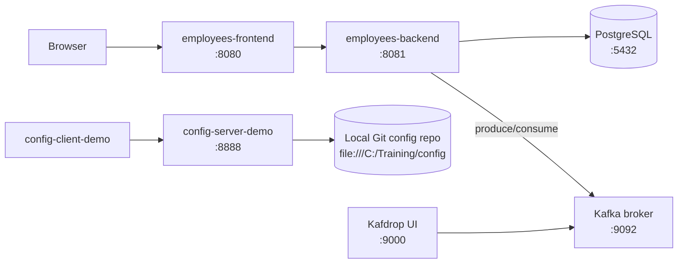
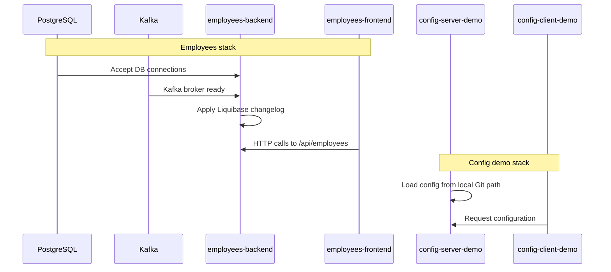

# Spring Cloud Training Workspace

This repository contains multiple Spring Boot/Spring Cloud demo applications:

- `config-server-demo`: Spring Cloud Config Server
- `config-client-demo`: Spring Cloud Config Client sample
- `employees-backend`: REST API + PostgreSQL + Liquibase
- `employees-frontend`: server-side UI that calls `employees-backend`
- `kafka/`: Docker Compose stack — Apache Kafka 4.2.0 (KRaft) + Kafdrop UI

## Architecture



## Modules

### `config-server-demo`

- App name: `config-server-demo`
- Port: `8888`
- Config source: local Git repo path set to `file:///C:/Training/config`

### `config-client-demo`

- App name: `config-client-demo`
- Intended to import config from the Config Server (`localhost:8888`)

### `employees-backend`

- App name: `employees-backend`
- Port: `8081`
- Database: PostgreSQL (`jdbc:postgresql://localhost:5432/employees`)
- DB migration: Liquibase (`classpath:db/db-changelog.yaml`)
- REST base path: `/api/employees`

### `employees-frontend`

- App name: `employees-frontend`
- Port: `8080`
- Calls backend at `http://localhost:8081`

### `kafka/` — Kafka + Kafdrop (Docker Compose)

Located in `kafka/docker-compose.yaml`. Single-node KRaft cluster (no ZooKeeper).

| Service | Image | Ports |
|---|---|---|
| `kafka` | `apache/kafka:4.2.0` | `9092` (external host access) |
| `kafdrop` | `obsidiandynamics/kafdrop:4.2.0` | `9000` (web UI) |

Listener layout:
- `EXTERNAL` (`:9092`) — for host-machine clients
- `CLIENT` (`kafka:9093`) — inter-container traffic (used by Kafdrop)
- `CONTROLLER` (`:9094`) — internal KRaft controller

## Prerequisites

- Java + Maven Wrapper (`mvnw` is included per module)
- Docker (for PostgreSQL and Kafka)

## Quick Start

### 1) Start PostgreSQL

```powershell
docker run -d -e POSTGRES_DB=employees -e POSTGRES_USER=employees -e POSTGRES_PASSWORD=employees -p 5432:5432 --name employees-postgres postgres
```

### 2) Start Kafka + Kafdrop

```powershell
docker compose -f kafka/docker-compose.yaml up -d
```

Kafdrop UI: [http://localhost:9000](http://localhost:9000)

To stop:

```powershell
docker compose -f kafka/docker-compose.yaml down
```

### 3) Run employees apps

Start backend:

```powershell
cd employees-backend
.\mvnw.cmd spring-boot:run
```

Start frontend (new terminal):

```powershell
cd employees-frontend
.\mvnw.cmd spring-boot:run
```

Open: `http://localhost:8080`

### 4) (Optional) Run config demo apps

Start Config Server:

```powershell
cd config-server-demo
.\mvnw.cmd spring-boot:run
```

Start Config Client (new terminal):

```powershell
cd config-client-demo
.\mvnw.cmd spring-boot:run
```

## Startup Order



## Useful Endpoints

- Frontend UI: `http://localhost:8080`
- Backend API list: `GET http://localhost:8081/api/employees`
- Backend API by id: `GET http://localhost:8081/api/employees/{id}`
- Kafdrop (Kafka UI): `http://localhost:9000`

See `employees-backend/employees.http` for ready-to-run API requests.

## Notes

- The Config Server currently points to `file:///C:/Training/config`; ensure this path exists on your machine or adjust `config-server-demo/src/main/resources/application.properties`.
- Additional auth-related properties are referenced in `employees-frontend` (`UserController`) and may require extra environment/config in some scenarios.
